# React + Vite

This template provides a minimal setup to get React working in Vite with HMR and some ESLint rules.

Currently, two official plugins are available:

- [@vitejs/plugin-react](https://github.com/vitejs/vite-plugin-react/blob/main/packages/plugin-react) uses [Babel](https://babeljs.io/) (or [oxc](https://oxc.rs) when used in [rolldown-vite](https://vite.dev/guide/rolldown)) for Fast Refresh
- [@vitejs/plugin-react-swc](https://github.com/vitejs/vite-plugin-react/blob/main/packages/plugin-react-swc) uses [SWC](https://swc.rs/) for Fast Refresh

## React Compiler

The React Compiler is not enabled on this template because of its impact on dev & build performances. To add it, see [this documentation](https://react.dev/learn/react-compiler/installation).

## Expanding the ESLint configuration

If you are developing a production application, we recommend using TypeScript with type-aware lint rules enabled. Check out the [TS template](https://github.com/vitejs/vite/tree/main/packages/create-vite/template-react-ts) for information on how to integrate TypeScript and [`typescript-eslint`](https://typescript-eslint.io) in your project.
# crowdfunding_back_end

A repo to contain my She Codes Crowdfunding back end project

# Crowdfunding Front End

Chelsea Murphy

## Planning:

### Concept/Name

Book Bank is a crowdfunding platform dedicated exclusively to improving literacy outcomes. The platform connects donors who are passionate about education with individuals, schools, and community organisations seeking funding for books, reading programs, and literacy initiatives. Unlike general crowdfunding sites, Book Bank focuses solely on literacy, creating a trusted space where every campaign directly impacts someone's ability to read, learn, and thrive.

Inspired by Roald Dahl's Matilda, the platform features verified campaigns, transparent fund tracking, and impact reporting that shows donors exactly how their contributions made a difference. Campaign creators can promote specific campaigns, fund adult literacy courses, or launch community reading programs. Donors can browse by cause, making it easy to support causes that resonate personally.
Book Bank rallies the community celebrating milestones with each funded campaign, sharing stories of transformation and progress. 

Literacy isn’t just an academic skill — it’s a human right and a tool for freedom. It empowers people to understand the world, imagine a better one, and have the voice to help create it.

### Intended Audience/User Stories

As an Educator, School year level coordinator, Librarian or School Parents & Citizens Association (P&C) I want to create a campaign for books so my students can access diverse, engaging reading materials. Alternatively I want to launch a campaign to fund places in literacy programs.

As a donor, I want to see campaigns so I can support literacy efforts in my own community.

As a parent, I want to fundraise for my child's reading needs so they can access new, different or specialised learning materials.

As a community organiser (such as an Aged Care facility or hospital), I want to launch a campaign for books or literacy alinged products or programs to support commnunity members to have a range of books or tools to support the love of reading.

### Functionality

Log In
    Log in with username and password
    Sign Up/Register

Home page
    See a list of 9 open fundraises
    Link to See 'more' fundraises (all fundraises including Closed)
    Link to Start a campaign
    Nav with Fundraisers, About, Contact and Login (which changes to My Account when logged in)

Fundraiser List
    - Search by title
    - Closed tage where relevant

User Profile
    See details of currently signed in User account details
    View past pledges
    View related fundraiser
    Browse fundraisers
    Create a fundraiser

Fundraiser
-Title
Image
Target amount to raise
Status: Open / Closed
Date of fundraiser creation
See total of pledges amount / progress to target
Pledges with amount, the supporter name/anonymous, comment
Edit Title/Image

Pledge
Make a pledge (amount, comment, anonymous/name)
Make an anonymous pledge

Example Screenshots:

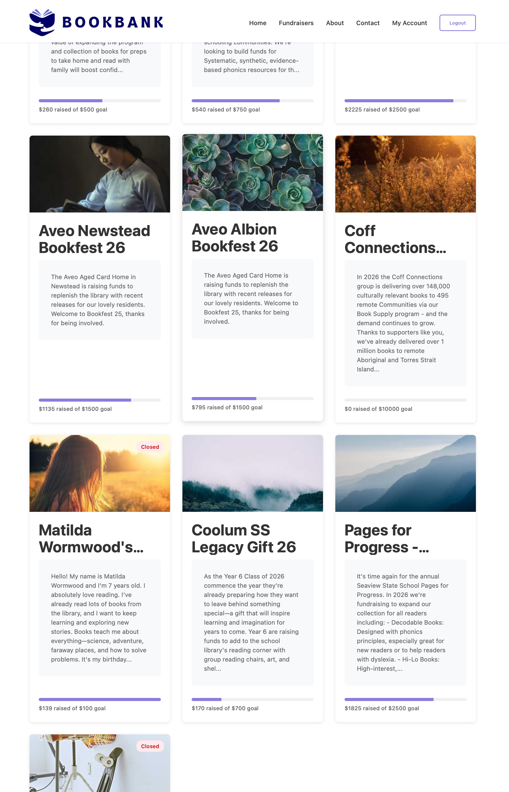
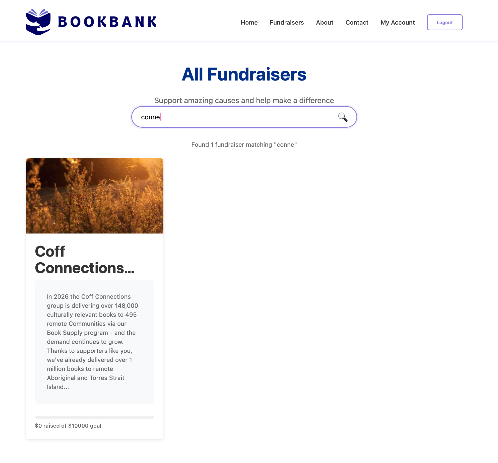

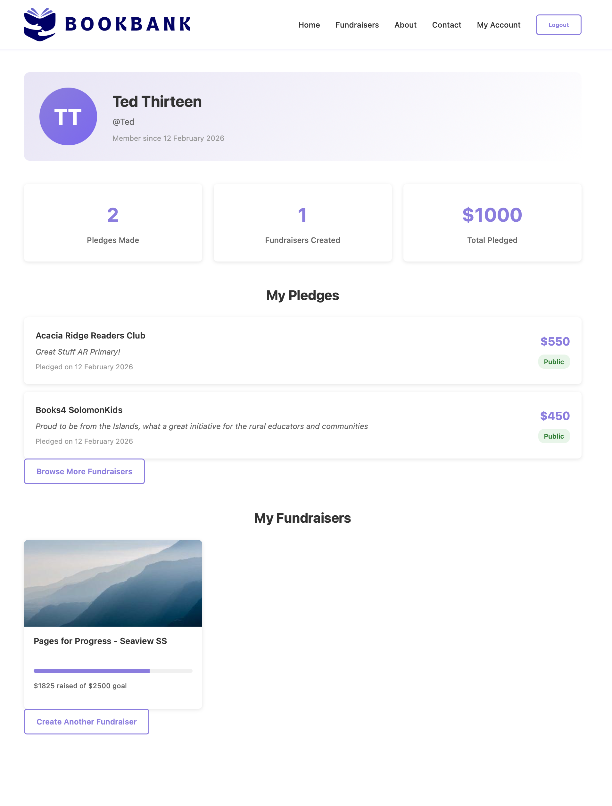
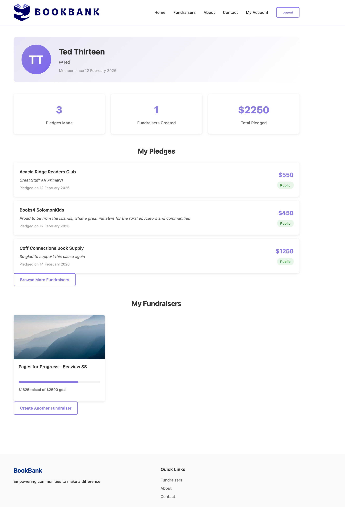
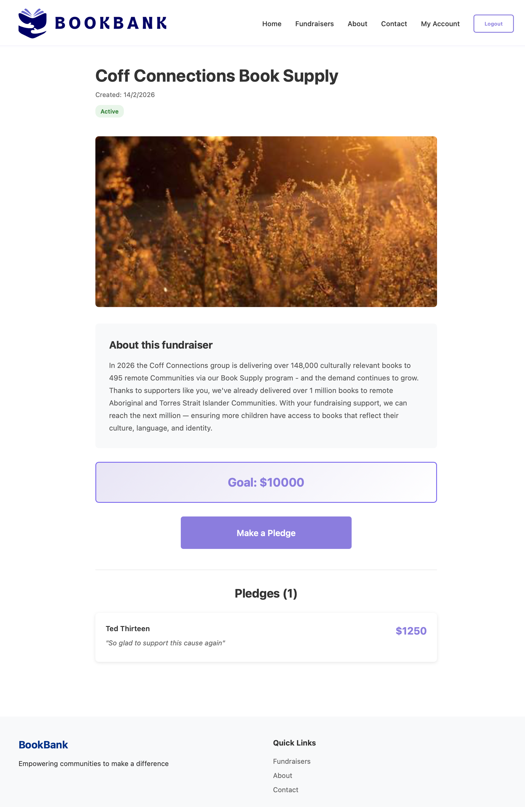
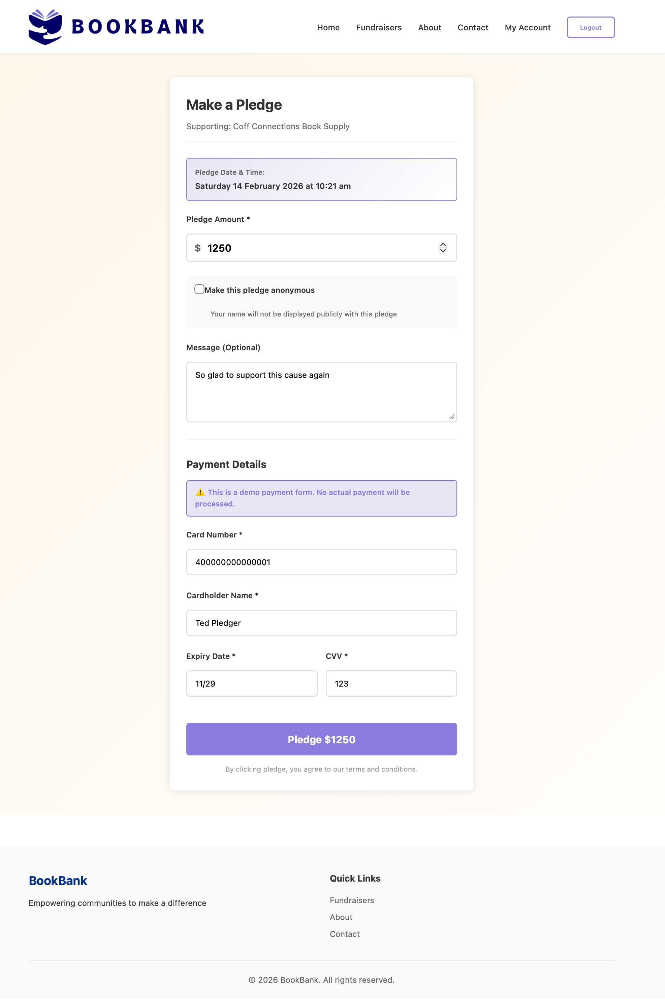

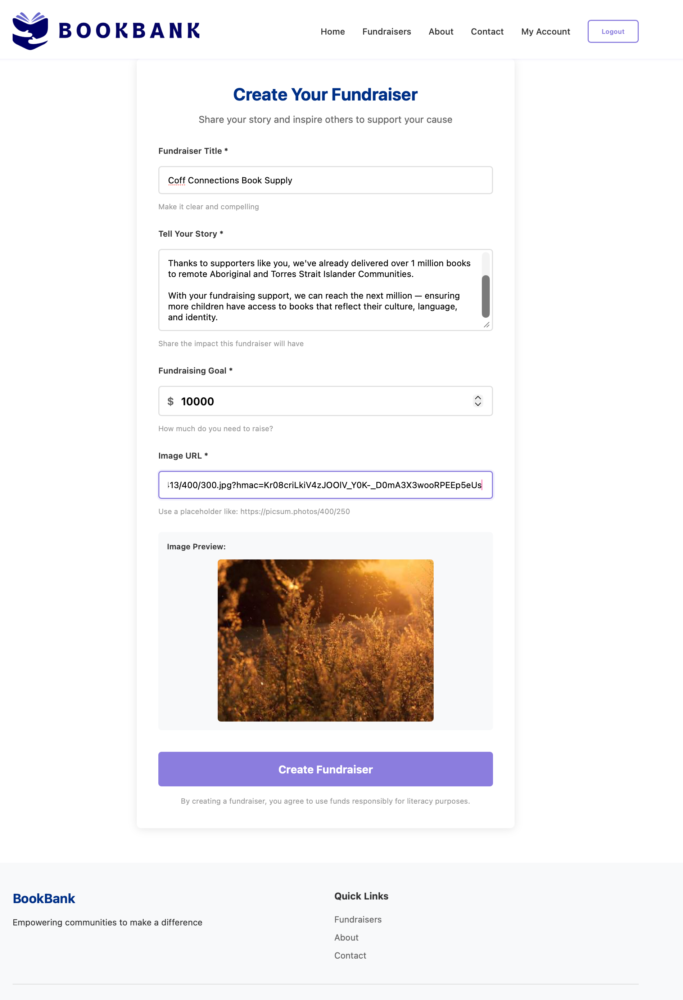
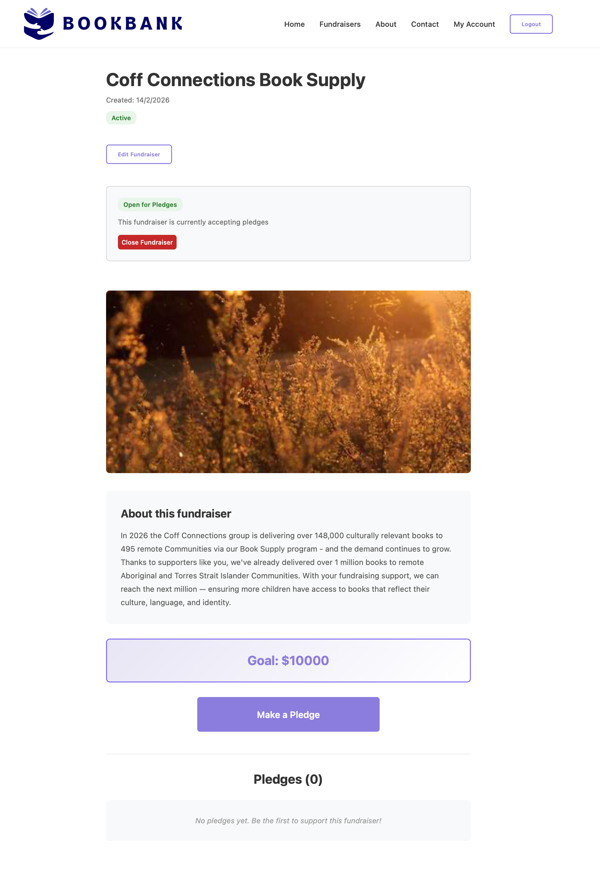
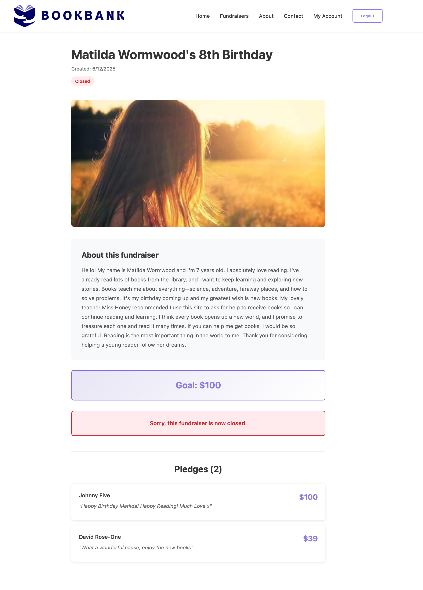
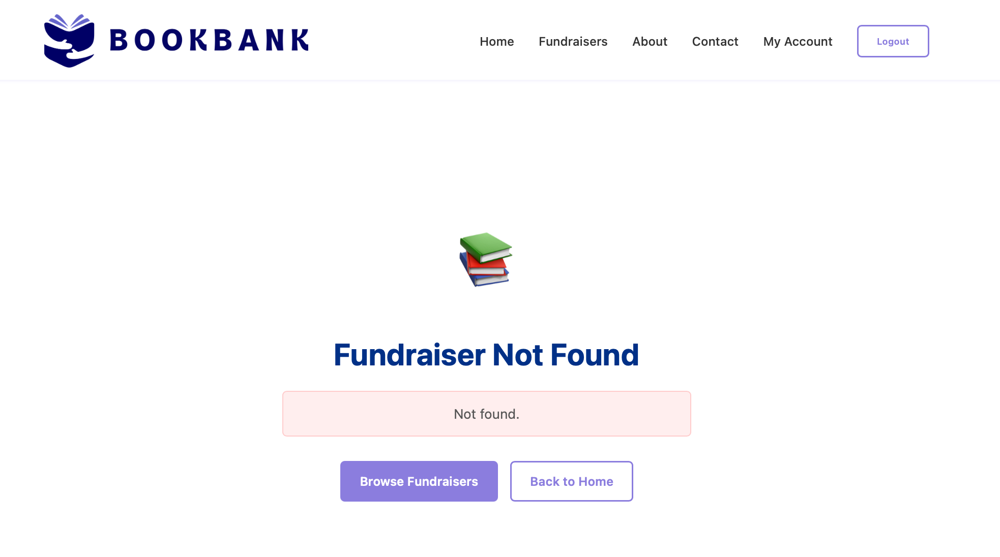
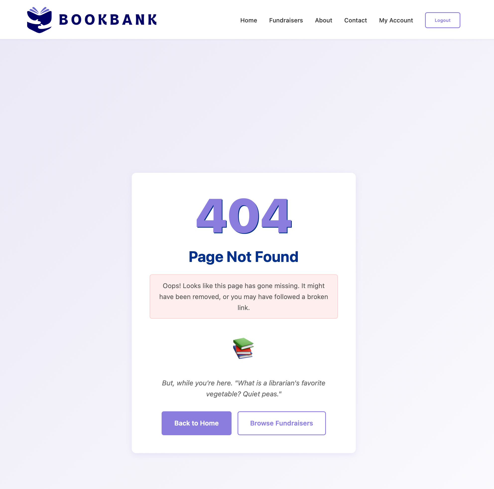 
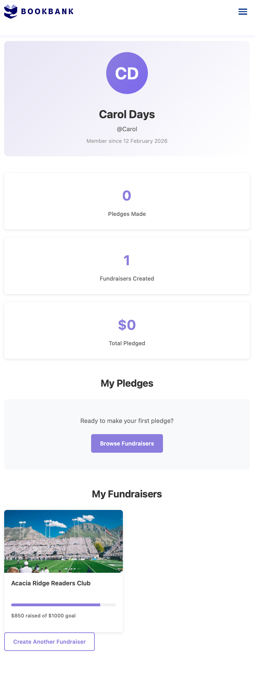 
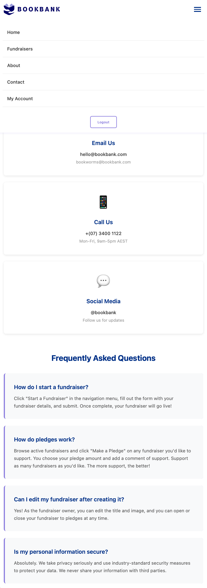 
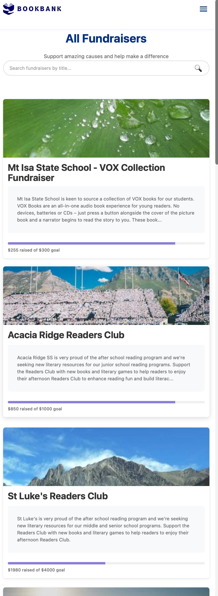